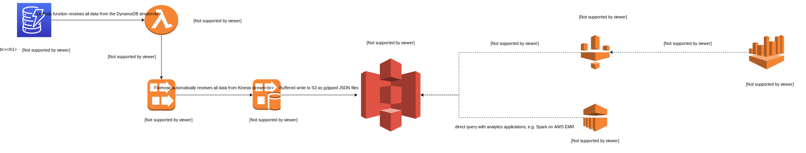

# dynalake

Out-of-the-box system for data ingestion from AWS DynamoDB
to a S3-based data lake as well as near-realtime analysis.
Implemented as a collection of completely customizable and extendable Terraform modules.



## Features
- completely serverless
- completely automated/managed
- easily scalable
- easily and completely extendable/customizable
- easy setup of 1 or many DynamoDB tables
- near-realtime, data is continously ingested into data lake
- immediately ready to be queried by AWS Athena or AWS Redshift Spectrum
- no change in application code that generates the data / writes it to DynamoDB necessary
- no additional load on DynamoDB table
- automatic data partitioning based on date
- basic monitoring with AWS CloudWatch

## Getting started

Copy the `example/` directory. Adjust the `dynamodb-datalake-pipeline.tf` file by filling out the `ENTER_..._HERE` sections with the AWS region, the environment (e.g. prod, staging, etc...) as well as the DynamoDB table name and it's stream ARN. You can also add more DynamoDB tables if you want.  
Now you can run `terraform init && terraform apply`. After this finished successfully, data will get ingested into S3 and after 10 minutes you will see a new table in AWS Athena that is ready to be queried.
  
**ATTENTION: DynamoDB streams has to be enabled on your table and the `VIEW_TYPE` has to be set to `NEW_IMAGE` or `NEW_AND_OLD_IMAGE`.**

## Configuration
The system is comprised of multiple Terraform modules that can be configured via input variables, see each modules `variables.tf` file for a description of each variable.

## Data Partitioning
This system [partitions](https://docs.aws.amazon.com/athena/latest/ug/partitions.html) the data in S3 by a specific datetime(dt) format `dt=yyyymmdd`.

```
dynamodb
└── json
    └── RECEIPTS
        ├── dt=00000000
            └── ...
        ├── dt=20190522
            └── ...
        ├── dt=20190523
            └── ...
        ├── dt=20190524
            └── ...
        └── dt=20190525
            ├──DYNAMODB-RECEIPTS-2-2019-05-25-02-00-29-33de3e64-cec3-46eb-9b7d-873bb7520eb2.json.gz
            └── DYNAMODB-RECEIPTS-2-2019-05-25-02-05-36-64500d1b-cd84-40e8-a275-420c08b394c2.json.gz
            └── ...

```

This allows for Athena queries like `select * from receipts where dt >= '20190523'`. This makes queries that are based on dates more efficient.  
Firehose by default saves the data in a nested directory structure (YYYY/MM/DD/HH) which doesn't allow for easy partitioning by AWS Glue/Athena.

## Data Retention and Throughput Limits
AWS Kinesis has a throughput limit of how much data it can ingest at the same time. If there is too much table activity on the DynamoDB table, the Lambda function will send too much data to Kinesis. Kinesis will respond with a `WriteProvisionedThroughputExceeded` exception. In that case the batch of data will be retried. However only up to 24 hours, which is the retention of DynamoDB streams. To avoid this situation you can increase the Kinesis shard count, which will allow you to ingest more data at the same time.

## Modifying this system
Pretty much everything here can be easily adjusted and modified to your liking.  
Don't like the S3 bucket naming or directory structure? Change it.  
Want to write the Lambda functions in another language? No problem.  
Don't need CloudWatch alarms? Remove them.  
Need different data partitioning? Have a look at AWS Firehose [custom prefixes](https://docs.aws.amazon.com/firehose/latest/dev/s3-prefixes.html)

### Why not ingest directly from Lambda to Firehose?
At the time of writing this (08/2019), the only way to increase/decrease the throughput limit of AWS Firehose is to ask via support ticket, which is not very practical. If this is not an issue for you, you can write from the Lambda function directly to the Firehose stream.

## Food for thought
### How do I get the data that was already in the DynamoDB table into the data lake?
The earliest DynamoDB data you will have in the data lake will be from the point on where you created this pipeline.  
To get all previous data from the DynamoDB table, you will have to run some sort of import job. We use AWS Glue Jobs for that.
We always save timestamp metadata(createdAt/updatedAt) on each item in DynamoDB. This allows us to create an import job that only imports the data up to a certain timestamp.

```
applymapping2 = Filter.apply(frame = applymapping1, f = lambda x: x.updatedat < 1562148836036 , transformation_ctx = "applymapping2")
```

This line tells the Glue Job to filter data based on updatedat timestamp. We then write this data from the initial import in a `dt=00000000` directory. Now we have the complete DynamoDB data of the table.

### Converting the data into another data format
The data in S3 will be in gzipped JSON format. However there are other data formats like Apache Parquet or ORC that are more efficient to query.  
We currently use AWS Data Pipeline to periodically transform the JSON source data into Parquet.

### Data Backup

Consider making backups of the S3 data.
